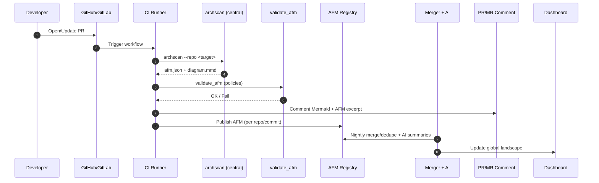

# Architecture Landscape — POC

> Automated, always-fresh architecture from code, configs, and CI.

## TL;DR
- Generate an **Architecture Fact Model (AFM)** + **diagram** from the repo.
- Comment results on PRs/MRs and validate against governance rules.
- Optionally aggregate across repos in a central registry for org views.

---

## 1) End-state architecture

```mermaid
graph LR
  %% Central-led, PR-aware; safe quoted labels
  subgraph repos["Code Sources"]
    A["Repo A — Web (GitHub)"]
    B["Repo B — Android (GitLab)"]
    C["Repo C — API (GitHub)"]
  end

  subgraph central["Central Scanner Repo"]
    O["'archscan' Orchestrator"]
    R["Rule Packs (Semgrep / Regex)"]
  end

  subgraph signals["Signals Collected"]
    S1["Source code (.kt/.java/.js/.py)"]
    S2["Build & deps (Gradle, buildSrc/Dependencies.kt, Version Catalogs)"]
    S3["Configs (AndroidManifest, OpenAPI/AsyncAPI, YAML)"]
    S4["IaC (Kubernetes/Terraform)"]
    S5["Runtime (OpenTelemetry / Mesh)"]
  end

  subgraph facts["Fact Registry & Services"]
    F["AFM Registry (JSON store)"]
    M["Merger/Deduper (cross-repo)"]
    G["Governance Validator (policies)"]
    X["AI/Agents ('namer', 'summarizer', 'drift explainer')"]
  end

  subgraph out["Delivery & Feedback"]
    P["PR/MR Comment (Mermaid + AFM)"]
    D["Landscape Dashboard (org/domain views)"]
    K["Component Docs (cards from AFM)"]
  end

  subgraph dev["IDE & Local Dev (optional)"]
    I["IDE Command / Pre-commit (archscan preview)"]
  end

  A-->O; B-->O; C-->O
  S1-->O; S2-->O; S3-->O; S4-->O; S5-->O
  O-->R
  O-- "emit" -->F
  O-- "validate" -->G
  G-- "status" -->O
  F-->M
  M-->X
  M-- "global diagrams" -->D
  M-- "cards" -->K
  O-- "PR/MR diagram + AFM" -->P
  I-- "preview diagram" --> dev
  ```

---

  ## 2) Lightweight AFM (what we store)

```json
  {
  "$schema": "https://json-schema.org/draft/2020-12/schema",
  "title": "Architecture Fact Model (AFM)",
  "type": "object",
  "required": [
    "components",
    "relations"
  ],
  "properties": {
    "components": {
      "type": "array",
      "items": {
        "type": "object"
      }
    },
    "relations": {
      "type": "array",
      "items": {
        "type": "object"
      }
    }
  }
}
```

**Principles**
- Every node/edge has **evidence**.

---

## 3) Where facts come from (signals)

- **Code:** imports & calls (AppAuth, Retrofit/OkHttp, `SQLiteDatabase`, OAuth flows).
- **Build/Deps:** `build.gradle(.kts)`, **version catalogs** (`gradle/libs.versions.toml`), **buildSrc/Dependencies.kt**, convention plugins.
- **Configs:** `AndroidManifest.xml` (redirect schemes/permissions), `openapi.yaml`, env/config YAML.
- **IaC:** K8s/Helm/Terraform (gateways, managed IdPs, DBs).

---

## 4) Where AI/Agents add outsized value

- **Naming & normalization** across repos (Auth/IdP/Keycloak → one node).
- **Summaries** for component cards from AFM + evidence.
- **Drift explanation**: reconcile runtime vs AFM; propose fixes.
- **Rule authoring**: turn policy text into Semgrep or AFM validators.
- **Remediation PRs**: add missing OpenAPI security, issuer allowlists, etc.

---

## 5) CI/CD & IDE (reference workflow)



---

## 6) How to use this repo

**Local dev (fast loop)**
```bash
python3 -m venv .venv && source .venv/bin/activate
python -m pip install --upgrade pip
python -m pip install -r requirements.txt

python archscan.py --repo . --out afm.json --diagram diagrams/landscape.mmd

# local android repo
python archscan_android.py --repo ~/code/android-repo   --out outputs/android-afm.json --diagram outputs/android.mmd
```

**Render diagram**
- Paste `.mmd` into the Mermaid Live Editor, or:
```bash
npm i -g @mermaid-js/mermaid-cli
mmdc -i diagrams/landscape.mmd -o diagrams/landscape.svg
```

---

## Policies & guardrails (examples)
- **Issuer allowlist** for OAuth (`config/allowed_issuers.txt`).
- **Issuer allowlist** for Persistence (`config/android-persistence`).
- **Issuer allowlist** for Upload (`config/android-upload`).
- **Issuer allowlist** for Android-Auth (`config/oauth-semgrep`).